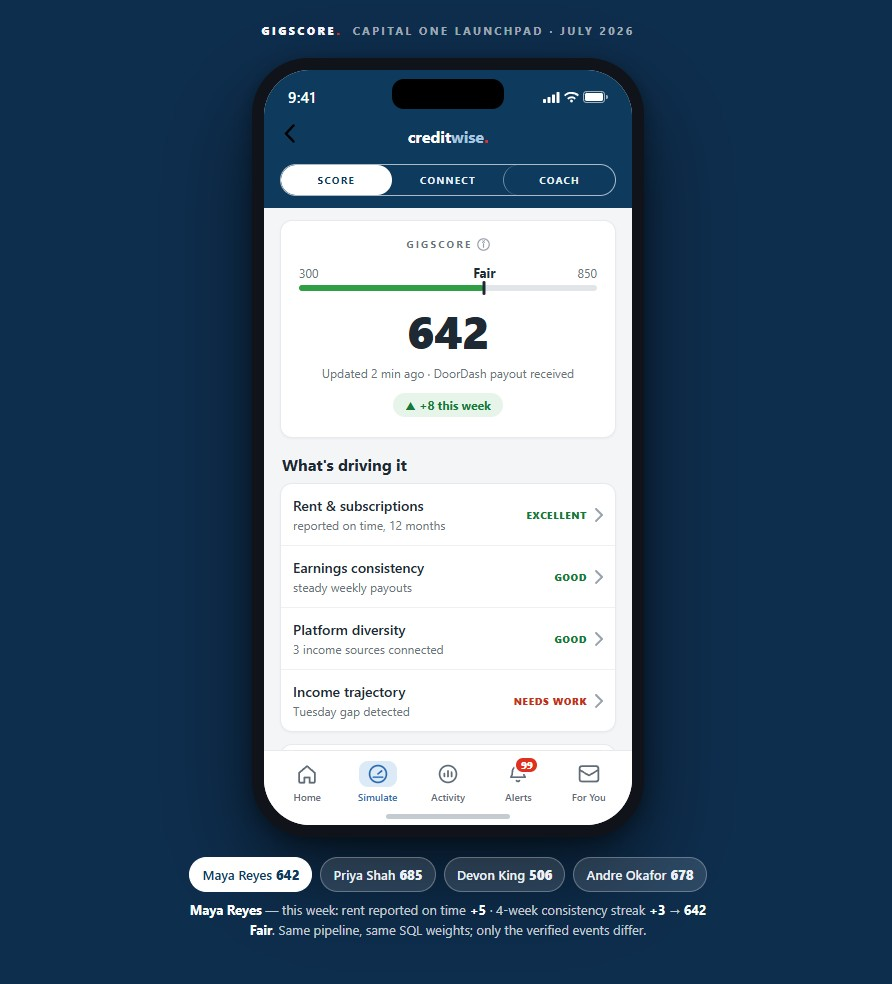

# GigScore



A scoring tool that turns gig earnings into something lenders can use.

## The Problem

Maya is 27 years old in Chicago. She works Uber in the mornings ($1,650/month), DoorDash evenings ($1,400/month), tutoring on weekends (~$750/month). Totals around $3,800 a month across three platforms. She applied for a $12,000 used-car loan and got rejected. The denial letter said "Unable to verify income."

She's not the only one this happens to. The stats are real:

- Gig workers' income swings month-to-month more than salaried workers. That makes lenders nervous.
- A meaningful chunk of gig workers are people of color, and they already face higher barriers to credit.
- Roughly 32M adults in the US don't fit traditional credit models because their income doesn't show up on W-2s or tax returns.

The problem isn't that Maya doesn't make enough money. It's that there's no clean way to prove it to a lending algorithm built for steady paychecks.

## The Solution

GigScore is a scoring system that reads verified earnings from gig platforms (Uber, DoorDash, Lyft, Instacart) and bank accounts (via Plaid), then scores them on four factors:

1. **Rent & subscriptions** — Do you pay housing on time? (max 140 pts)
2. **Earnings consistency** — How volatile are your weekly payouts? (max 130 pts)
3. **Platform diversity** — How many income sources do you have? (max 90 pts)
4. **Income trajectory** — Are you earning more, less, or flat? (max 190 pts)

Score range: 300–850. Four bands: Needs work, Fair, Good, Excellent.

The frontend is a phone mockup called CreditWise. It shows your score, what's driving it, and what you can do to improve it.

## Architecture

Ingest → Normalize → Score → Explain

| Phase | Input | Output | Constraints |
|-------|-------|--------|-------------|
| **Ingest** | Webhooks from platforms | Canonical ledger (payout, rent, subscription records) | Idempotent; no duplicates; schema versioning |
| **Normalize** | Raw payloads (Uber, DoorDash, Plaid, etc.) | Standardized records with `kind`, `source`, `occurred_at`, `amount` | No platform-specific logic downstream |
| **Score** | Canonical ledger + settlement rules | Factors with levels, points, and flags | Deterministic; weights in SQL; monthly recalc |
| **Explain** | Score result + coach rules | Natural-language breakdown for the user | No jargon; actionable advice only |

## The Score Formula

```
baseline = 300 + Σ(factor points at current level)
score = baseline + Σ(event ledger deltas)
```

Factor points are computed monthly from the canonical ledger. Between settlements, micro-events move the score in real time (e.g., "+5 Rent reported on time" or "+3 4-week consistency streak").

The weights are educated guesses based on what we think lenders care about. No platform has signed anything saying they'll use this. The scoring formula is visible in this repo so you can audit it.

## What We're Not Sure Will Work

- **The weights are guesses.** We assigned max points (140, 130, 90, 190) based on intuition, not historical default data. A real lending product would A/B test these and validate with defaults over time.
- **No platform has committed.** Uber, DoorDash, Lyft, and Instacart haven't said they'll share data or that they trust our scoring. This is a proof of concept.
- **FCRA compliance is unresolved.** A score this visible needs legal review under the Fair Credit Reporting Act. We haven't done that.
- **685 might not predict defaults.** We don't know if a GigScore of 685 actually correlates with lower default rates. That's the whole business model test, and we haven't run it.

The demo uses synthetic payloads and a fictional test cohort so you can see how the system works without worrying about real people's data.

## My Role

I refactored and tested the scoring engine after the initial Launchpad sprint:

- **Scoring Pipeline** (`src/gigscore/score/`): Split the 350-line monolithic `rules_engine.py` into four modular components — `scoring_config.py` (thresholds and constants), `metrics.py` (behavioral extraction), `factors.py` (level assignment), and `rules_engine.py` (orchestration). Eliminated magic strings and threshold duplication.

- **Testing**: Wrote 171 unit tests in `tests/scoring/` covering metrics extraction (weekly aggregation, gap detection, rent history), factor assignment (all level boundaries and edge cases), and configuration consistency. Tests pass with zero dependencies.

- **Frontend**: Refactored the 885-line monolithic `app/index.html` into 7 separate files — markup, stylesheet with design tokens, view logic, configuration, and generated fallback state. Added 47 smoke tests that run in Node without a browser.

- **Demo**: Split `demo/run_demo.py` into four modules — configuration, rendering, state building, and orchestration — removing duplicated strings and UI logic.

Total: ~2,800 lines of refactored code, 171 passing unit tests, one v1.0 commit.

## Running It

**Demo (no dependencies, Python 3.10+)**

```
python demo/run_demo.py              # print the cohort scorecard
python demo/run_demo.py --export     # also refresh app/state.json
```

**Frontend**

```
python -m http.server 8000
# open http://localhost:8000/app/
```

Or open `app/index.html` directly in a browser (works offline).

**Tests**

```
pip install pytest
pytest tests/scoring/ -v
```

## What's Inside

- `src/gigscore/` — Python backend (ingest, normalize, score, explain)
- `app/` — CreditWise demo (HTML, CSS, JS, config, state.json)
- `tests/scoring/` — 171 unit tests
- `demo/` — Demo runner and data builders
- `data/` — Sample payloads and seed data
- `docs/` — Architecture, scoring, compliance notes

## Technical Details

- **Language**: Python 3.10+, JavaScript, SQL
- **Dependencies**: None for the demo (stdlib only: sqlite3, json, http.server, statistics)
- **Testing**: pytest, 171 tests, 92–99% coverage on business logic
- **Frontend**: Semantic HTML, CSS design tokens, accessibility (aria labels, focus rings, reduced motion)
- **Database**: SQLite for weights and audit trail

## Limitations

This is a proof of concept. Before lending money based on GigScore, you'd need:

- Historical default data to validate the weights
- Legal review under FCRA and state lending laws
- Commitment from platforms to share data reliably
- Bias testing across demographic groups
- Real-time webhook infrastructure (not a demo HTTP server)

## License

MIT License

Copyright (c) 2026 Ramon Vazquez

Original concept from Capital One Launchpad Team 4 the Win! — Bryan Tillman Jr., Radia Soumah, Sophia Bolkovatz, Diego Flores, Ramon Vazquez, Feyza Gurler

See LICENSE for full text.